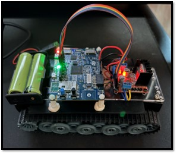
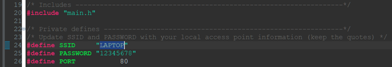
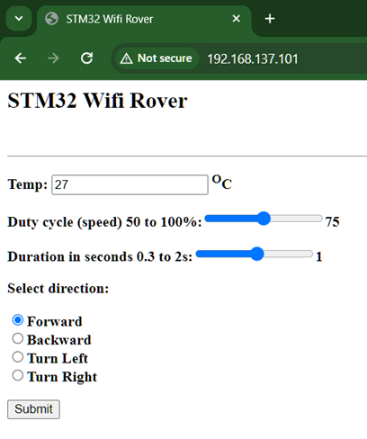
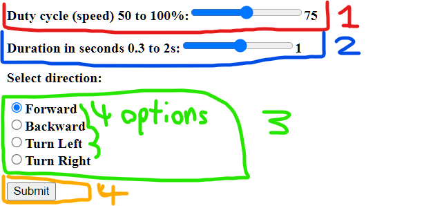

Elijah Martin
ENEE459V
6/13/24

**Wi-Fi Controlled Rover Manuel**
**Description:**  This document includes instructions for assembly and usage to create a remote-controlled rover using the B-L475\_IOT01A1 microprocessor board, a robot chassis, a DC motor controller, and a Wi-Fi HTTP interface for control.

**Hardware Needed:** 
- B-L475\_IOT01A1 microprocessor board
- L298N DC motor-controller/voltage-regulator 
- Tank/Robot Chassis with two DC motors for the rover
- Power Supply (two 18650 batteries wired in series) 
- Wires, and or breadboard jumper wires

**Wiring Diagram:** 
**Note:** I used an Arduino UNO in my diagram as a stand in for the Arduino headers on the  B-L475\_IOT01A1, **you must also put a jumper on the 5V\_ARD header pin on the underside of the B-L475\_IOT01A1 to use the VIN pin on the microcontroller otherwise the board won’t power on.**

**Large Photo of Completed Project for Reference:**

**Programming:**
In the source folder which is in: Final Project\HTTP\_Server\_Files\B-L475\_IOT01A1\_WebServer\_ws\Project\Core\Src, Change the header in main.c to have your computer’s hotspot SSID and password. 

Then upload the project to the board, and if you moved the header pin on the underside to 5V\_ARD pin make sure to move it back on to the 5V\_STLINK pin to upload the code.

**HTTP Webpage Guide:** 
Search in your hotspot’s network in settings to find the IP address of the microcontroller connected to your computer’s hotspot:

Then go to your web browser and type in the IP address of the microcontroller:

After entering the webpage, you should see this interface:

**Using the Robot Webpage Interface:**
The robot has four different inputs and three parameters for control from the webpage:
1. A slider for the duty cycle which controls the speed of the motors.
2. A second slider for the duration of the movement in seconds
3. A 4 multiple-choice option to select the direction of movement. “Forward” will move the robot in a straight line forward, “Backward” will move the robot backwards, “Turn Left” will pivot the robot in place and turn left or counterclockwise, and “Turn Right” will turn the robot clockwise in place.
4. A submit button to send your parameters to the robot.

**Testing the Robot:**
1. **Test if the robot moves, leave the webpage inputs as default, and click the submit button.** The robot should move forward in a line for 1 second, and the webpage should update if everything is working correctly.
2. **Test the duty cycle,** leave the webpage inputs as default but move the duty cycle slider to 50% and submit and observe, and then change it again to 100% and submit and observe again. The robot shouldn’t be able to or will barely move at 50%, and then at 100% the robot should move forward quickly.
3. **Test the duration,** leave the webpage inputs as default but move the duration slider to 0.3 seconds and submit and observe, and then change it to 2 seconds and submit and observe again. The robot should move forward for a brief period of 0.3 seconds when set so, and for a longer period of two seconds on the second trail.
4. **Test the direction,** leave the webpage inputs as default but change the direction to “Backward” and submit, wait until finished and then select “Turn Left” and submit, and finally wait and select “Turn Right” and submit. You should observe that the robot moves straight backwards, then counterclockwise in place, and finally it should move clockwise in place and stop. Each movement should be for a duration of 1 second.

**If the robot passes these tests, then it is working correctly, and you can then move it freely as you wish using the webpage interface.**

**Video DEMO:** 

**Project Notes:**
1. Do not buy the chassis I used for the project it arrived with a broken axle that I had to fix with glue, it is fragile, and the motors were coated in grease that made soldering difficult:

2. Avoid frequent quick movements at 100% duty cycle, changing direction using the maximum amount of power may cause the motors to draw too much to keep the microcontroller powered. 
